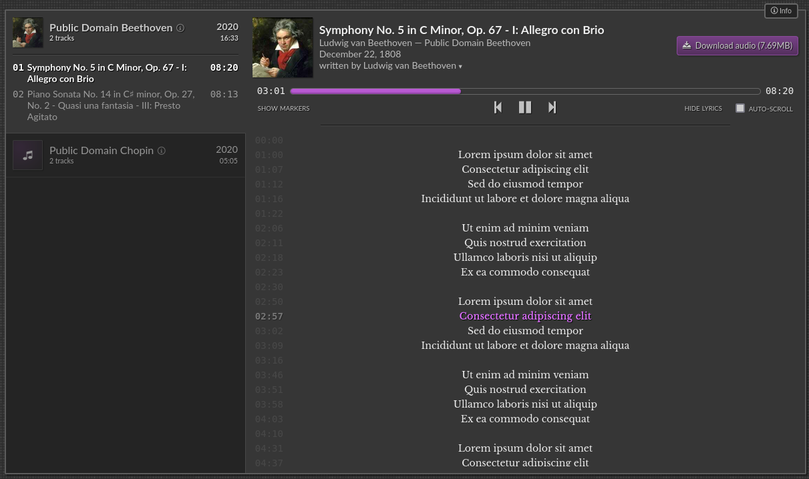
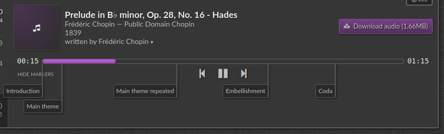

# An Album


A nice-looking music player and album navigator. This was written
purely to showcase my own music in a more navigable way, while
also providing easy downloads of audio, scores and full albums.

The code is pretty spaghetti-like, but it probably works.

## Demo
- https://music.tmont.com/

## Screenshots






## Features

- Audio playback/pause
- Multiple audio sources per track
- Seek to arbitrary timestamp
- Easy navigation between albums and tracks
- Lyrics support (in .lrc format)
    - highlights active line in real time
    - each lyric line seeks to time on click
- Download links for audio, scores and albums
- Mobile-friendly
- Deep-links directly to an album or track via query string parameters using `history.replaceState()`
- Time markers with annotations
- Keyboard shortcuts
    - `L`: toggle lyrics
    - `M`: toggle markers
    - `Space`: play/pause
    - `Left`: seek backward 10 seconds
    - `Right`: seek forward 10 seconds
    - `Ctrl+Left`: go to previous track
    - `Ctrl+Right`: go to next track
    - `Alt+Left`: go to previous album
    - `Alt+Right`: go to next album
- Works on Chrome and Firefox, and maybe some other browsers

## Usage

Add the CSS to your `<head />` and the JavaScript to your `<body />`. Then
instantiate a `UI` object and mount it to an existing DOM node. See
`./test.html` for an example.

Make sure to copy the `./fonts/` folder as well, or modify the CSS to not
use local fonts. It uses Libre Baskerville for lyrics and Lato for everything else.

A small icon font is inlined in the CSS.

```html
<!DOCTYPE html>
<html lang="en">
  <head>
    <meta charset="UTF-8">
    <meta name="viewport" content="width=device-width, initial-scale=1">
    <title>Some pretty neat music</title>
    <link rel="stylesheet" href="./analbum.css" />
  </head>
  <body>
    <div id="mount"></div>

    <script src="./analbum.js"></script>
    <script>
      (function() {
        const albums = [
            analbum.album(
              'Slapdash', 
              [
                analbum.track('Stray Accordion Strut', {
                  duration: 120345,
                  date: 2020,
                  artist: 'Slippy and the Slap Rats',
                  trackNum: 1,
                  sources: [
                    analbum.source('./audio/stray-accordion-strut.mp3', {
                      size: 6451345,
                      mimetype: 'audio/mpeg',
                    }),
                  ],
                  writers: [ 'Slippy McSlapperson' ],
                  contributors: [
                    analbum.contributor('Slippy McSlapperson', [ 'vocals', 'accordion' ]),
                    analbum.contributor('Ray Finkle', [ 'electric washboard' ]),
                    analbum.contributor('Lois Einhorn', [ 'sticks and bucket' ]),
                    analbum.contributor('Dan Marino', [ 'bass clarinet', 'harpsichord', 'lute', 'backing vocals' ]),
                  ],
                }),
              ],
              {
                date: 2020,
                artist: 'Slippy and the Slap Rats',
                description: 'Slippy really outdid himself on this one. Full of toe-tapping polka smash hits.',
              },
            ),
        ];
   
        const player = new analbum.UI({
          description: 'A collection of my favorite Slippy McSlapperson records',
          albums,
        });
        player.mount(document.getElementById('mount'));
      }());
    </script>
  </body>
</html>
```


